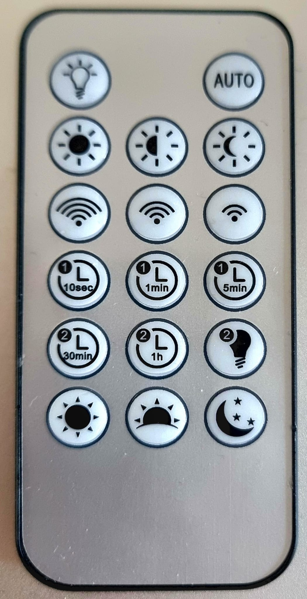

## DecodeBaltimoreRC
Decodes IR Remote Control HX1838 codes for each button:

|   |   |   |
|---|---|---|
| **A1**  [&nbsp;&nbsp;93]| **B1**  | **C1**  [&nbsp;&nbsp;29]|
| **A2**  [221]| **B2**  [253]| **C2**  [&nbsp;&nbsp;61]|
| **A3**  [&nbsp;&nbsp;31]| **B3** [&nbsp;&nbsp;21]| **C3**  [&nbsp;&nbsp;9]|
| **A4*** [&nbsp;&nbsp;22]|  **B4**  [25]| **C4**  [13]|
|     **A5** | **B5** [&nbsp;&nbsp;24]| **C5**      |
| **A6** [&nbsp;&nbsp;8]|  **B6**  [199]| **C6**  [165]|
|     **A7** | **B7** [181]| **C7**     | 
 
 

Packaged with Baltimore 5000lumen, 50W LED floodlight with motions sensor 
( ZD Trading Model No: 3005472)
 
IR button codes decoded with [ShowRawIRCode](../ShowRawIRCode)
## Gebruiken als extensie

Deze repository kan worden toegevoegd als **extensie** in MakeCode.

* open [https://makecode.microbit.org/](https://makecode.microbit.org/)
* klik op **Nieuw project**
* klik op **Extensies** onder het tandwielmenu
* zoeken naar **https://github.com/roboracemsw/DecodeBaltimoreRC** en importeren

## Dit project bewerken

Om deze repository te bewerken in MakeCode.

* open [https://makecode.microbit.org/](https://makecode.microbit.org/)
* klik op **Importeren** en klik vervolgens op **Importeer URL**
* plak **https://github.com/roboracemsw/DecodeBaltimoreRC** en klik op importeren

#### Metadata (gebruikt voor zoeken, rendering)

* for PXT/microbit

> Open deze pagina op [https://roboracemsw.github.io/decodebaltimorerc/](https://roboracemsw.github.io/decodebaltimorerc/)

## Gebruiken als extensie

Deze repository kan worden toegevoegd als **extensie** in MakeCode.

* open [https://makecode.microbit.org/](https://makecode.microbit.org/)
* klik op **Nieuw project**
* klik op **Extensies** onder het tandwielmenu
* zoeken naar **https://github.com/roboracemsw/decodebaltimorerc** en importeren

## Dit project bewerken

Om deze repository te bewerken in MakeCode.

* open [https://makecode.microbit.org/](https://makecode.microbit.org/)
* klik op **Importeren** en klik vervolgens op **Importeer URL**
* plak **https://github.com/roboracemsw/decodebaltimorerc** en klik op importeren

#### Metadata (gebruikt voor zoeken, rendering)

* for PXT/microbit

